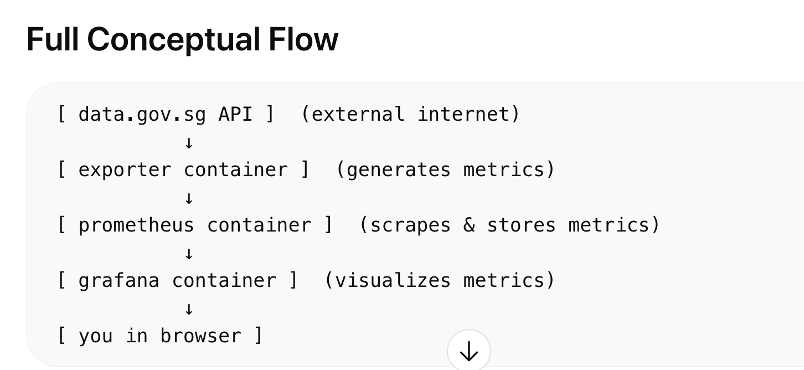
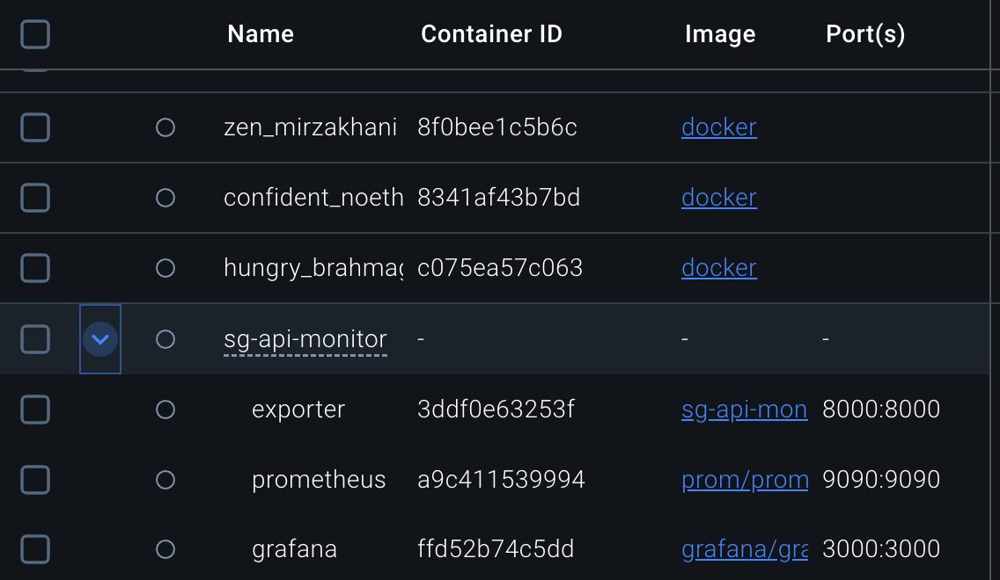
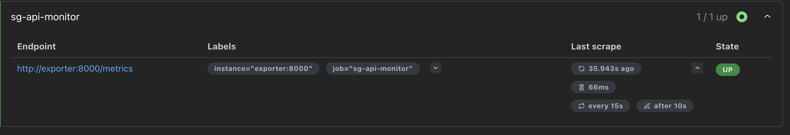
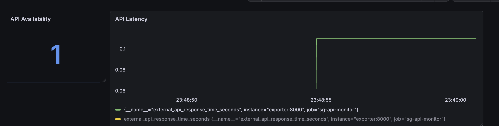
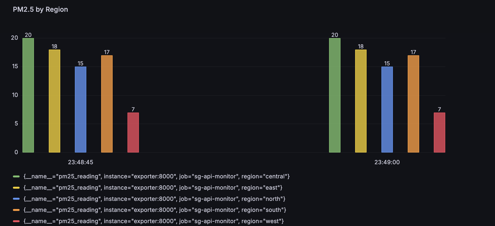

# SG API Monitor — Observability with Prometheus & Grafana

A lightweight **observability system** that monitors a real-world public API using a **custom Prometheus exporter**, **Prometheus**, and **Grafana**.

The system collects environmental data from **data.gov.sg** and transforms it into **Prometheus metrics**, enabling real-time monitoring of **API latency, availability, and air quality metrics**.

This project demonstrates how DevOps and SRE teams monitor **external dependencies** in production environments.

---

# 🚀 Why This Project Exists

Modern systems rely heavily on **third-party APIs**:

* Payment gateways
* Government APIs
* Authentication providers
* Data providers

But external dependencies introduce **risk**:

* API latency spikes
* Unexpected downtime
* Data inconsistencies

This project demonstrates how to build a **lightweight observability pipeline** to monitor these external services proactively.

---

# 🏗 Architecture

```
[data.gov.sg API]
        │
        ▼
[Python Exporter]
(Converts JSON → Prometheus Metrics)
        │
        ▼
Prometheus (Scrapes every 15s)
        │
        ▼
Grafana Dashboard
```



---

# ⚙️ Tech Stack

| Component      | Purpose                     |
| -------------- | --------------------------- |
| Python         | Custom exporter             |
| Flask          | Expose `/metrics` endpoint  |
| Prometheus     | Metrics scraping & storage  |
| Grafana        | Visualization               |
| Docker         | Containerization            |
| Docker Compose | Multi-service orchestration |
| EC2            | Cloud deployment            |

Key technologies:

* Prometheus
* Grafana
* Docker
* Amazon EC2

---

# 📊 Metrics Collected

The exporter collects and exposes the following metrics:

| Metric                               | Description                         |
| ------------------------------------ | ----------------------------------- |
| `external_api_response_time_seconds` | API latency                         |
| `external_api_up`                    | API availability (1 = up, 0 = down) |
| `pm25_reading{region}`               | Air quality values per region       |

Example output from `/metrics`:

```
external_api_response_time_seconds 0.23
external_api_up 1
pm25_reading{region="west"} 12
pm25_reading{region="east"} 14
```

---

# 🐳 Running the Project

## Clone the repository

```bash
git clone https://github.com/<your-username>/sg-api-monitor.git
cd sg-api-monitor
```

---

## Run with Docker Compose

```
docker compose up --build
```

This will start:

| Service    | Port |
| ---------- | ---- |
| Exporter   | 8000 |
| Prometheus | 9090 |
| Grafana    | 3000 |

---

## Access the Services

Exporter metrics

```
http://localhost:8000/metrics
```

Prometheus UI

```
http://localhost:9090
```

Grafana dashboard

```
http://localhost:3000
```

Default credentials

```
admin / admin
```

---

# 📈 Grafana Dashboard

The dashboard visualizes:

### API Latency

```
external_api_response_time_seconds
```

### API Availability

```
external_api_up
```

### PM2.5 Air Quality by Region

```
pm25_reading
```

---

# 📷 Screenshots

### Docker Containers



### Prometheus Metrics



### Grafana Dashboard





---

# ☁️ Deployment

The monitoring stack can be deployed on:

* Local environment
* Cloud VM
* Kubernetes clusters
* Production observability systems

In this project it is deployed on:

**Amazon EC2**

---

# 🧠 Industry Relevance

This architecture mirrors real-world observability practices used by **DevOps and SRE teams**.

Common production use cases include:

* Monitoring payment gateway APIs
* Tracking third-party vendor reliability
* Measuring API latency and uptime
* Detecting SLA violations
* Observing external dependencies

External APIs are a **frequent source of production incidents**. Proactive monitoring significantly reduces **MTTR (Mean Time to Recovery)**.

---

# 📂 Project Structure

```
sg-api-monitor
│
├── exporter.py
├── requirements.txt
├── Dockerfile
├── docker-compose.yml
├── prometheus.yml
│
└── snapshots
    ├── flowchart.png
    ├── Docker_images.png
    ├── prom_view.png
    ├── Grafana1.png
    └── Grafana2.png
```

---

# 🔮 Future Improvements

Possible extensions:

* Alerting with Alertmanager
* Slack / Email notifications
* Kubernetes deployment
* Infrastructure as Code
* Synthetic monitoring
* CI/CD automation

---

# 👩‍💻 Author

**Ayushi Singh**

DevOps Engineer | AI Enthusiast | Tech Speaker

I enjoy building practical systems that demonstrate **DevOps, observability, and automation in real-world scenarios**.

LinkedIn:
[(https://www.linkedin.com/in/the-ayushi-singh/))Let's Connect on LinkedIn

---

# 📜 License

MIT License

---

# ⭐ If You Like This Project

If you found this project useful:

* Star the repository
* Share feedback
* Suggest improvements

---
